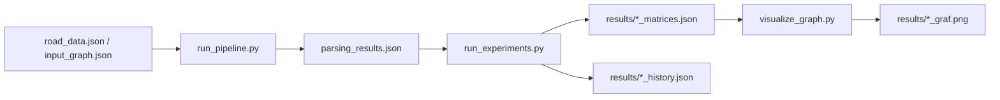

# Dokumentacja techniczna

## Cel repozytorium

Repozytorium zawiera implementację problemu remontu dróg rozwiązywanego dwiema metaheurystykami:

- algorytm genetyczny (`GA`)
- algorytm pszczeli (`Bee Colony`)

Model minimalizuje makespan remontu z ograniczeniem budżetowym dla ekip.

## Aktualny przepływ danych



`run_pipeline.py` jest zalecanym jednym punktem wejścia do całego workflow. Wykonuje on kolejno:

1. import danych OSM z `road_data.json` do `parsing_results.json`,
2. uruchomienie eksperymentów,
3. generowanie wizualizacji.

## Pliki i odpowiedzialności

| Plik | Odpowiedzialność |
|---|---|
| `src/model.py` | definicje instancji problemu, harmonogramu, oceny rozwiązań i kar |
| `src/ga.py` | implementacja algorytmu genetycznego |
| `src/bee.py` | implementacja algorytmu pszczelego |
| `run_experiments.py` | uruchamianie eksperymentów dla jednego grafu lub wielu konfiguracji |
| `run_pipeline.py` | jedno polecenie uruchamiające import, eksperymenty i wizualizację |
| `visualize_graph.py` | budowa rysunków z plików `*_matrices.json` |
| `real_data_import.py` | historyczny skrypt importu danych OSM; logika importu została odwzorowana w `run_pipeline.py` |

## Wejścia i wyjścia

### Wejścia

- `input_graph.json` - przykładowy graf do szybkich testów,
- `road_data.json` - surowy eksport OSM / Overpass,
- pliki konfiguracyjne w `configs/`.

### Wyjścia

- `parsing_results.json` - graf przygotowany do solverów,
- `results/<out>.csv` - metryki końcowe,
- `results/<out>_matrices.json` - najlepsze rozwiązania, harmonogramy i overlap,
- `results/<out>_history.json` - przebieg fitnessu w kolejnych iteracjach/pokoleniach,
- `results/<out>_graf.png` - wizualizacja wygenerowana przez `visualize_graph.py`.

## Konfiguracja eksperymentów

### Pojedynczy scenariusz

`run_experiments.py` obsługuje klasyczne uruchomienie jednego grafu:

```powershell
python run_experiments.py --graph input_graph.json --repetitions 10 --iterations 120 --out single_graph_results.csv
```

### Pliki konfiguracyjne algorytmów

Parametry GA można przechowywać w JSON, np. `configs/ga_config_example.json`.

Dostępne pola:

- `population_size`
- `generations`
- `crossover_rate`
- `mutation_rate`
- `tournament_size`
- `elite_count`
- `seed`

Parametry Bee można przechowywać w JSON, np. `configs/bee_config_example.json`.

Dostępne pola:

- `colony_size`
- `iterations`
- `limit`
- `neighborhood_flips`
- `seed`

### Wiele konfiguracji w jednym pliku

`configs/runs_example.json` pokazuje format `runs-config`.
Każdy wpis może nadpisać:

- `graph`
- `repetitions`
- `iterations`
- `out`
- `ga_config`
- `bee_config`

Jeżeli w jednym pliku są dwie konfiguracje, uruchomienia są wykonywane sekwencyjnie: najpierw pierwszy wpis, potem drugi.

## Jak używać nowego pipeline

Najprostszy wariant:

```powershell
python run_pipeline.py --road-data road_data.json --runs-config configs/runs_example.json
```

Domyślnie pipeline:

- zbuduje `parsing_results.json`,
- uruchomi eksperymenty,
- wygeneruje wizualizacje z `results/`.

Jeżeli chcesz pominąć któryś etap, możesz użyć:

- `--skip-import`
- `--skip-experiments`
- `--skip-visualize`

## Logika modelu

Wynik optymalizowany przez solver to makespan:

$$
Z(s, X) = \max\{s_e + t(e) \mid e \in E\}
$$

Model uwzględnia:

- koszt ekip liczony dziennie,
- ograniczenie budżetowe,
- twardą karę za nakładanie się prac tej samej ekipy,
- harmonogramowanie zadań według wagi `load * base_time`.

## Wizualizacja

`visualize_graph.py` czyta wszystkie pliki `*_matrices.json` z katalogu `results/` i generuje obraz PNG dla każdego zestawu wyników.

Uruchomienie:

```powershell
python visualize_graph.py
```

## Uwagi praktyczne

- `results/` jest katalogiem roboczym dla artefaktów, które można bezpiecznie regenerować.
- Duży `road_data.json` lepiej trzymać poza kontrolą wersji, jeśli jest tylko surowym eksportem wejściowym.
- `run_pipeline.py` nie zmienia istniejących programów, tylko łączy je w jeden prosty workflow.